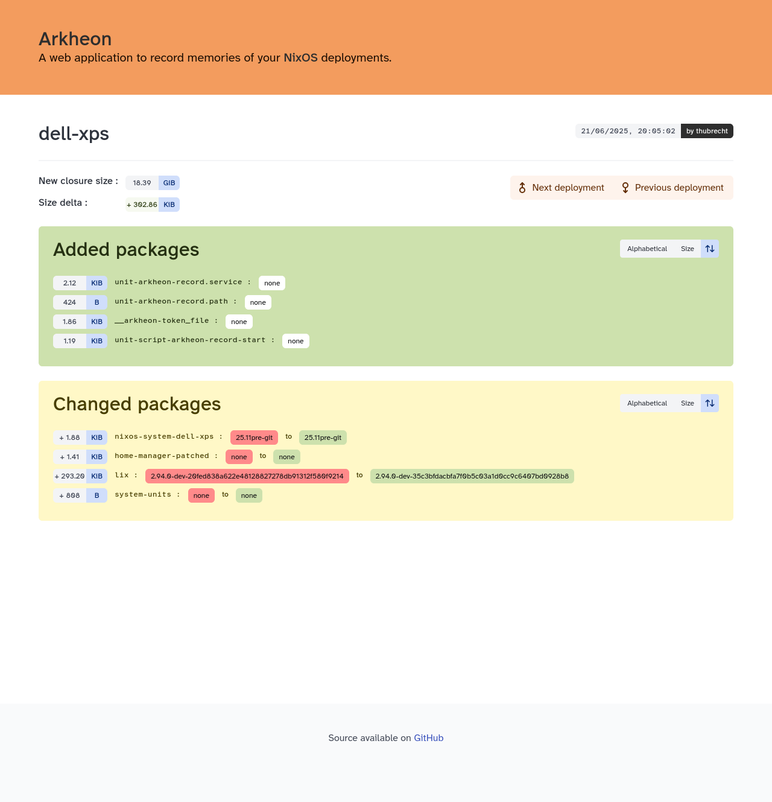

<!--
SPDX-FileCopyrightText: 2025 Tom Hubrecht <github@mail.hubrecht.ovh>

SPDX-License-Identifier: EUPL-1.2
-->

# Arkheon

Arkheon is a very simple FastAPI-based web application to record memories of your NixOS deployments.



## API documentation

### Records a deployment

```
POST /record/<identifier>
{ "toplevel": $toplevel, "bootspec": $bootspec, ... }
```

This will record a deployment at this point in time for that `<identifier>` machine.

## Developer TODO

### Short term

- API to register webhooks to call upon deployments: regex on machine identifier?
- Production packaging
- NixOS module

### Medium term

- Client side NixOS module / automation:
  - colmena can record at any effective activation (i.e. can compute it at dry activation time the closure, send it only if any switch operation is done either boot, test or effective activation).
- Move to PostgreSQL
- Do proper bulk insertion when possible
- Cache results to comparisons as they are immutable (on-disk? LRU policy?)
- Pre-compute comparisons between deployment N - 1 and N at record time as a background task
- NixOS tests
- Prometheus endpoint for metrics?
- Recognize if a deployment is idempotent and do nothing, e.g. if the closure is already stored, create a new deployment and reflink it to the previous one.
- Netbox synchronization
- Linking Git metadata and deployment data

### Long term

- Deployments/closures can be sealed to prevent any tampering, do something like FSPRG:
  - Generate a verification key that should be stored somewhere else.
  - Generate a sealing key that can stay on the deployment of arkheon.
  - and do it like FSS.
  - Will probably require the involvement of Rust to write it properly and re-expose it via Python.
